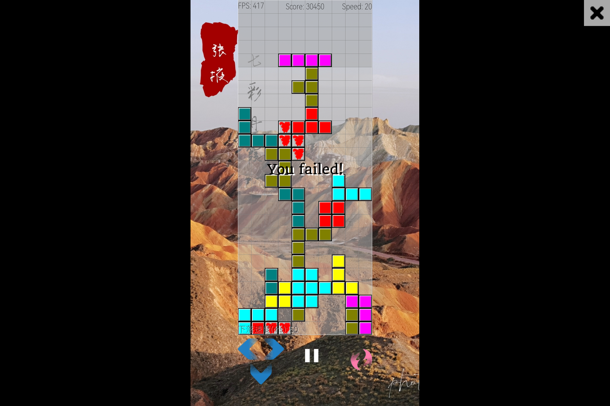
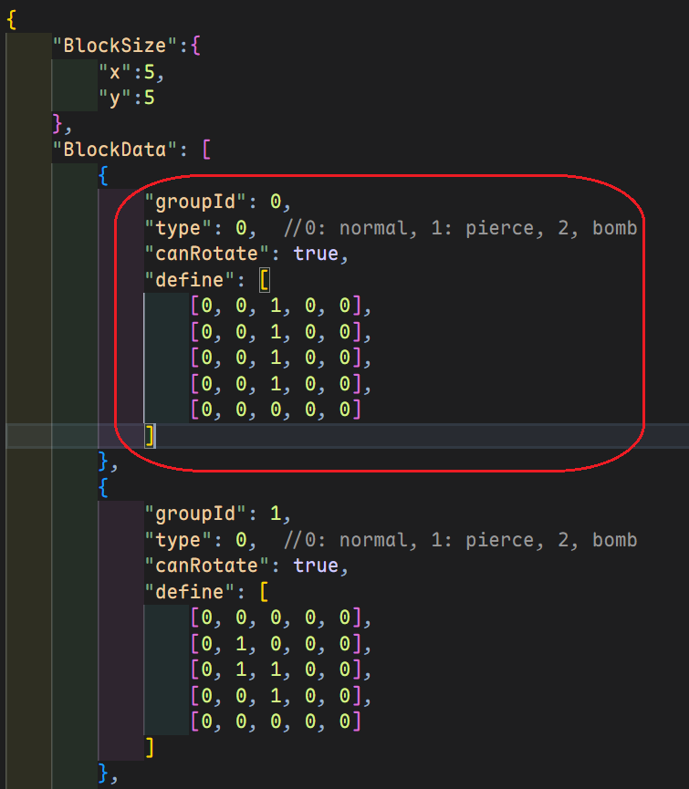

# Tetris

## Features

Tetris is a cross-platform game developed using SDL3, but now it can run on Windows-x64 and Android-arm64v8. There are default total 12 kind of blocks, including ***penetration*** block and ***bomb*** block, you can extend as you like.

## ScreenShots




## Download and Installation

You can download the game from [Release]([Releases · SeaOceanLiu/Tetris](https://github.com/SeaOceanLiu/Tetris/releases)).

### Windows

Run Tetris.exe directly after extracting the game to your disk. Use the keyboard arrow keys to move the block, use the space bar to rotate the block, and press the P key to pause. If it is a touch screen, you can also directly click the buttons on the screen for operation.

### Android

The Android version needs to be installed before running, and there may be a long time black screen during loading, please be patient! 

## Build

We build this game on windows.

### for Windows

Run ***x64 Native Tools Command Prompt for VS 2022*** from you start menu.

```powershell
cd ./VisualStudio/Tetris
msbuild Tetris.sln -p:Configuration=Release
```

The target files is located in ***./VisualStudio/Tetris/x64/Release***. You can change ***Release*** to ***Debug*** in the above command If you need debug version. You can use following command to clean the build target file.

```powershell
msbuild Tetris.sln -t:Clean
```


### for Android


```powershell
cd ./AndroidStudio/Tetris/com.seaocean.Tetris
./gradlew build
```

you can use following command to clean the build target file.

``` powershell
./gradlew clean
```


## Custom block expansion configuration

The block configuration is defined in the file located as ***./core/assets/config/RBlock.jsonc***, this is a JSON format file whit comment. you can define your block in these sections:



##### groupId

Defines the group number of the block, which should be incremented in order from 0.

##### type

Defines block types, currently there are only three types of blocks: **0 for regular blocks**, **1 for penetrating blocks**, and **2 for bomb blocks**.

##### canRotate

defines whether a block can be rotated, usually it should be ***true***, but if a certain type of block should not be rotated, this value should be set to ***false***. For example, the default definition of penetrating blocks and bomb blocks cannot be rotated, as they are both blocks with only one unit.

##### define

It is a 5x5 two-dimensional matrix that defines the specific appearance of a block. A value of 0 in the matrix indicates that there is no block at that location, while a non-zero value indicates that there is a block at that location. The rotation of a block revolves around the center point of a 5x5 matrix, so the rotation center of the block should be placed at the center point of the 5x5 matrix.

